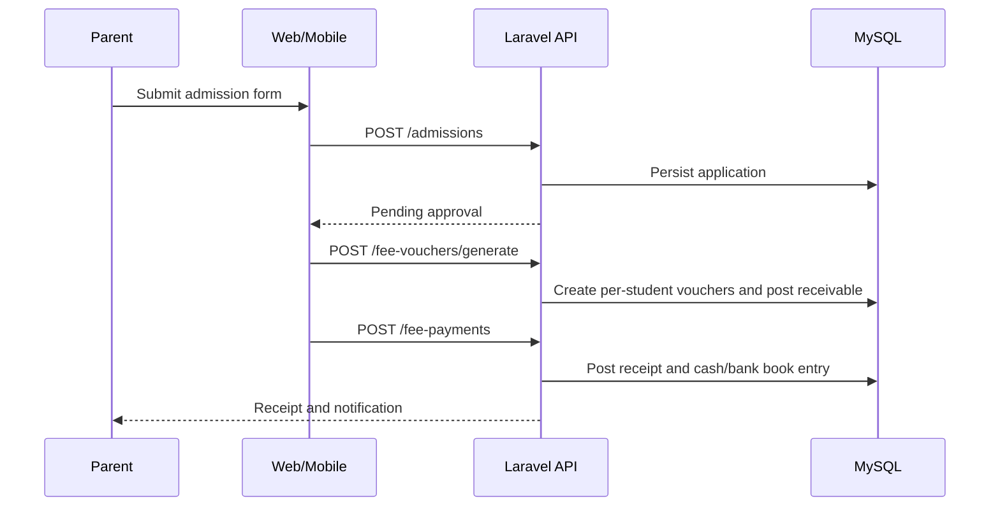

# Architecture

## Stack

| Layer | Technology |
| --- | --- |
| API | PHP 8.2, Laravel 11, Sanctum, Spatie Permission, Spatie Activitylog |
| Database | MySQL 8 / MariaDB 10.11 (utf8mb4) |
| Web | Next.js (App Router), Tailwind CSS, TanStack Query |
| Mobile | Expo (React Native) |
| Queue / cache | Laravel queue (database), Redis in production |

## Repository layout

```
apps/api      Laravel API
apps/web      Next.js web application
apps/mobile   Expo mobile application
docs          Specification, architecture and runbook
```

## Request lifecycle (API)

```
Client (web/mobile)
  -> Authorization: Bearer <sanctum token>
  -> SecurityHeaders middleware (global)
  -> auth:sanctum
  -> tenant middleware (ResolveTenant)
       product owner -> bypass isolation, optional X-Campus-Id filter
       other users   -> institution guardrail + campus from X-Campus-Id
                        if permitted, else default campus
  -> permission middleware (module.action)
  -> controller -> resource
```

## Tenant isolation

This is multi-tenant SaaS: many institutions, each with many campuses. Campus is
the tenant boundary; institution is a guardrail. MySQL has no row-level
security, so isolation is enforced in the application layer:

- Models with `institution_id` use `App\Support\Concerns\BelongsToInstitution`;
  the Institution model itself is scoped on its own key.
- Models with `campus_id` use `App\Support\Concerns\BelongsToCampus`; the Campus
  model itself is scoped on its own key.
- `TenantContext` carries the active institution/campus and whether each is
  enforced. Institution is always enforced for tenant users; campus is enforced
  whenever a campus is active.
- `ResolveTenant` sets the context per request. The product owner (Super User)
  runs with isolation bypassed and may filter to one campus; campus users are
  pinned to a permitted campus; `RequireCampusContext` (alias `campus`) can
  guard routes that must have a campus.
- Tests in `apps/api/tests/Feature/TenantIsolationTest.php` guard cross-campus
  and cross-institution isolation.

## Response conventions

- Successful single resources: `{"data": {...}}`.
- Collections: `{"data": [...], "links": {...}, "meta": {...}}` (Laravel pagination).
- Errors: `{"message": "...", "errors": {"field": ["..."]}}` with an appropriate
  HTTP status (401, 403, 409, 422, 429).

## Security posture

- Strict security headers on every response (CSP, HSTS on HTTPS, X-Frame-Options,
  X-Content-Type-Options, Referrer-Policy, Permissions-Policy).
- Login throttled to 5 attempts per email/IP per minute.
- Fine-grained permission middleware on every protected route.
- Sensitive fields hidden from serialization (password, 2FA secrets).
- Audit log for authentication, RBAC and organisation changes.
- Two-factor enforcement is configurable and off until the enrolment flow ships.

## Access control model

- Permissions: `module.action`, defined in `config/rbac.php`.
- Roles: bundles of permission patterns seeded by `RbacSeeder`.
- Scope: `ScopeAssignment` binds a user's role to an institution/campus.
- The product owner (Super User) creates institutions and the campus admin
  account for each campus (`RoleName::restrictedToProductOwner()`).
- A campus admin creates local accounts with limited roles; they cannot create
  other campus admins or platform admins.
- A user may only select a campus they hold a scope for.

## Academic structure

Every academic record is campus-scoped and the `academic` permission module
gates access. Routes live under the `auth:sanctum` + `tenant` + `campus` stack,
so a campus must be active before any academic write; the product owner selects
one with `X-Campus-Id`.

- Hierarchy: AcademicYear -> Term; Stage -> ClassRoom -> Section; Subject and
  ClassSubject (subject-to-class mapping per academic year).
- `TeachingAssignment` binds teacher x subject x class x section x year and
  enforces two guards: one active teacher per subject slot per year, and a
  weekly workload ceiling (`config/academic.php`,
  `ACADEMIC_MAX_TEACHER_WEEKLY_PERIODS`, default 40).
- `AcademicEvent` covers the calendar (holiday, exam, event, meeting).
- Referenced entities are validated with campus-scoped `Rule::exists`, and
  `StampsAcademicTenant` writes `institution_id`/`campus_id` on create.
- Endpoints: `/api/v1/{academic-years,terms,stages,classes,sections,subjects,class-subjects,teaching-assignments,academic-events}`.

## Timetable

- `Period` defines the daily bell schedule; `Room` defines physical rooms with
  block/floor.
- `TimetableSlot` places subject + teacher + room on a day/period for a
  class/section/year (optionally a term).
- On create/update the API rejects three clashes within the same year, term,
  day and period: class slot, teacher double-booking and room double-booking. A
  subject must be mapped to the class and, when a teacher is set, the teacher
  must hold the matching teaching assignment.
- Publish control: `POST /api/v1/timetable-slots/{publish,unpublish}` flips
  `is_published`. Views (`/api/v1/timetable/{classes/{class},teachers/{user},me}`)
  hide drafts from users without `timetable.approve`, so students, parents and
  teachers only see published timetables while coordinators and campus admins
  see drafts.

## Finance (double-entry)

- `FiscalYear` is per campus and defaults to a standard period; at most one is
  marked `is_current` per campus.
- `ChartOfAccount` is per campus, typed by `AccountType` (asset, liability,
  equity, income, expense) with a `normal_balance` derived from the type. Group
  accounts (`is_group = true`) are structural headings; only leaf accounts are
  postable. Parent/child links give the reporting hierarchy.
- `JournalEntry` carries a `reference`, `entry_date`, `status` (draft, posted,
  reversed) and optional polymorphic `source`. `JournalLine` holds one account
  and a debit xor credit amount.
- `JournalService` owns the invariants: an entry must have at least two lines,
  each line a single positive amount, and total debits must equal total credits
  before it can be posted.
- Immutability: posted entries cannot be edited or deleted. `POST
  /api/v1/journal-entries/{id}/reverse` creates an offsetting entry (debits and
  credits swapped), posts it, and marks the original `reversed`. Because both
  the original and its reversal are counted in reports, the pair nets to zero.
- A default per-campus chart of accounts is provided by
  `App\Services\Accounting\DefaultChartOfAccounts`.
- Endpoints: `/api/v1/{fiscal-years,chart-of-accounts,journal-entries}` plus
  `POST /api/v1/journal-entries/{id}/{post,reverse}` and reports
  `/api/v1/finance/reports/{trial-balance,ledger/{account}}`. Writing requires
  `finance.create`/`finance.edit`; posting and reversal require
  `finance.approve`.

## Budgets

- `Budget` is a campus-scoped plan bound to one `FiscalYear` and a period type
  (annual, semi-annual, quarterly, monthly) with a `starts_on`/`ends_on` window.
  Budget names are unique per campus and fiscal year.
- `BudgetLine` records the planned amount per postable (non-group)
  `ChartOfAccount`; group accounts are rejected. Lines are replaced atomically
  when a draft is updated.
- Lifecycle is `draft` → `approved`. Only drafts can be edited, updated or
  archived; `POST /api/v1/budgets/{id}/approve` requires `finance.approve`,
  stamps the approver and locks the record.
- `GET /api/v1/finance/reports/budget-vs-actual?budget_id={id}` compares each
  line's budget to the actual ledger movement within the budget window. Actuals
  include posted and reversed entries, signed by the account's normal balance;
  each row returns budget, actual, variance, utilisation and a favourable flag
  (under-budget spend or on-target income), plus budget/actual/variance totals.
- Endpoints: `/api/v1/budgets` guarded by the `finance` permission module
  (view/create/edit/delete/approve).

## Expenses and payables

- `Vendor` is a campus-scoped supplier/payee with an optional `payable_account_id`
  (defaults to the chart's `Vendor Payable` account 2010).
- `ExpenseCategory` is a campus-scoped charge type linked to a leaf expense
  account; `ExpenseLine` records the amount per category.
- `Expense` is a vendor bill with a campus-numbered reference (`EXP-000001`),
  date, bill number, status (`draft` -> `approved` -> `partial`/`paid`, or
  `void`) and a link to the posted journal entry. Drafts are editable; approval
  posts Dr each category expense account / Cr accounts payable.
- `ExpensePayment` settles a bill with a campus-numbered reference (`PV-000001`),
  posting Dr accounts payable / Cr cash or bank (by method). Payments recalculate
  the bill's paid amount and status; overpayment is rejected. `void` reverses the
  settlement (`finance.approve`) and reopens the bill.
- `void` on the bill itself is allowed only once no active payment remains; it
  reverses the approval entry and sets the status to `void`.
- Endpoints: `/api/v1/{vendors,expense-categories,expenses,expense-payments}`
  guarded by the `finance` permission module; approval/void require
  `finance.approve`.
- Reports: `GET /api/v1/finance/reports/payables` ages outstanding bills
  (current, 1-30, 31-60, 61-90, 90+ days) and
  `GET /api/v1/finance/reports/expenses` summarises approved spend by category
  and vendor over a date range.

## Cash, bank and reconciliation

- `BankAccount` is a campus-scoped cash, bank, petty-cash or mobile-wallet
  account linked to a leaf asset `ChartOfAccount`, with an opening balance and
  optional bank details. Petty cash is simply a `petty_cash` account, giving it
  a separate ledger account (FR-3.5).
- `BankReconciliationService` derives book balances from the posted ledger:
  a balance is the account's opening balance plus the net movement of its chart
  account. Draft journal entries are ignored; posted and reversed entries count.
- `GET /api/v1/finance/reports/cash-book` returns, for one account, a statement
  of lines with a running balance and opening/closing figures; without an
  account it returns a per-account summary.
- `BankReconciliation` stores a snapshot for a `statement_date`: the computed
  `book_balance`, the user-entered `statement_closing_balance` and the
  `difference`. Completing requires the difference to be within tolerance
  (`finance.approve`); drafts can be edited, completed records are locked.
- Endpoints: `/api/v1/{bank-accounts,bank-reconciliations}` guarded by the
  `finance` permission module (`view`/`create`/`edit`/`delete`, `approve` to
  complete).

## Fee management

- `FeeHead` is a campus-scoped billable charge (tuition, admission, transport)
  linked to a leaf income `ChartOfAccount`, so billing and receipts post to the
  ledger.
- `FeePlan` binds a named fee structure to an academic year and class.
  `FeePlanItem` holds the amount per fee head (with an optional flag for
  charges such as transport). `FeeInstallment` defines the collection schedule
  as ordered percentages that must total 100.
- The plan resource returns required/optional/grand totals. Updating a plan
  replaces its items and installments in one transaction.
- `FeeVoucher` is a per-student, per-installment demand note generated for every
  actively enrolled student in a class. Vouchers split the annual amount by the
  installment percentage; optional items are excluded and annual discounts are
  allocated across lines proportionally (rounding fixed on the last line).
  Voucher numbers are unique per campus (`FV-000001`).
- `FeeBillingService` posts billing as Dr Student Fee Receivable / Cr each fee
  head income account, and collection as Dr Cash/Bank / Cr Student Fee
  Receivable. Posted vouchers are immutable; correction happens through
  `void` (requires `fee.approve`), which reverses the journal entry and blocks
  while posted payments exist.
- `FeePayment` records a receipt (campus-numbered `RV-000001`) against a voucher
  or as an advance. Partial payments recalculate the voucher's paid amount and
  status (`unpaid`/`partial`/`paid`); overpayment beyond the voucher balance is
  rejected. `void` reverses the collection entry and reopens the voucher. A
  voucher-less payment is an advance and credits `Fees Received in Advance`
  (2030) instead of receivables; `POST /api/v1/fee-payments/{id}/apply` allocates
  it to a voucher (Dr advance / Cr receivable).
- `FeePlan` may carry a late fee policy (`late_fee_type` none/flat/percent,
  `late_fee_amount`, `late_fee_grace_days`). `POST
  /api/v1/fee-vouchers/{id}/late-fee` applies it once per voucher after the
  grace period, posting Dr receivable / Cr `Late Fee Income` (4050) and
  increasing the voucher amount.
- `FeeRefund` returns money against a payment. Refunding an applied payment
  debits receivable and reopens the voucher (paid amount is net of refunds);
  refunding an advance debits the advance liability. Both credit cash/bank and
  are campus-numbered (`RF-000001`).
- Endpoints: `/api/v1/{fee-heads,fee-plans,fee-vouchers,fee-payments,fee-refunds}`
  guarded by the `fee` permission module. Generating vouchers requires
  `fee.create`; voiding, applying late fees and issuing refunds require
  `fee.approve`; allocating an advance requires `fee.edit`.

## Fee reports

- `FeeReportController` reads the voucher and payment tables; it never writes.
  All endpoints are guarded by `fee.view`.
- `/api/v1/fee-reports/defaulters` returns outstanding vouchers grouped by
  student and class, aged against an `as_of` date into current and 1-30, 31-60,
  61-90, 90+ day buckets, with a summary of students, vouchers and outstanding
  totals. `overdue_only=0` includes vouchers not yet due.
- `/api/v1/fee-reports/students/{student}/statement` is a running-balance
  statement of every voucher (debit) and receipt (credit), with opening and
  closing balances and billed/paid/outstanding totals.
- `/api/v1/fee-reports/classes/summary` aggregates billed, collected,
  outstanding and collection rate per class.
- `/api/v1/fee-reports/collection` breaks collections down by method and by day
  over a date range.

## Students and guardians

- `Student` holds the profile (admission number, gender, dates, contact and
  identity fields). `admission_no` is unique within a campus and is generated
  when omitted.
- `Guardian` holds the responsible adult; `student_guardian` is a many-to-many
  pivot carrying the relationship, primary and emergency-contact flags. A
  guardian can be linked to several students.
- `StudentEnrollment` is the year-by-year class/section history
  (one enrollment per student per academic year) with a roll number and an
  `EnrollmentStatus`. Section allocation must match the chosen class.
- Withdrawal/transfer sets the student status and closes active enrollments with
  an end date. Promotion rolls active enrollments from one academic year/class
  to the next, optionally repeating selected students.
- Endpoints: `/api/v1/{students,guardians,student-enrollments,students/promote,
  students/{student}/withdraw}` guarded by the `student` permission module.
- This foundation is what fee billing uses to raise per-student vouchers and
  receipts.

## Sequences

Admissions and fee collection:



## Environment

See `apps/api/.env.example`, `apps/web/.env.example` and
`apps/mobile/.env.example`. Copy each to `.env` and fill in the values.

Deferred by decision: localization, RTL layout, currency and calendar options.
